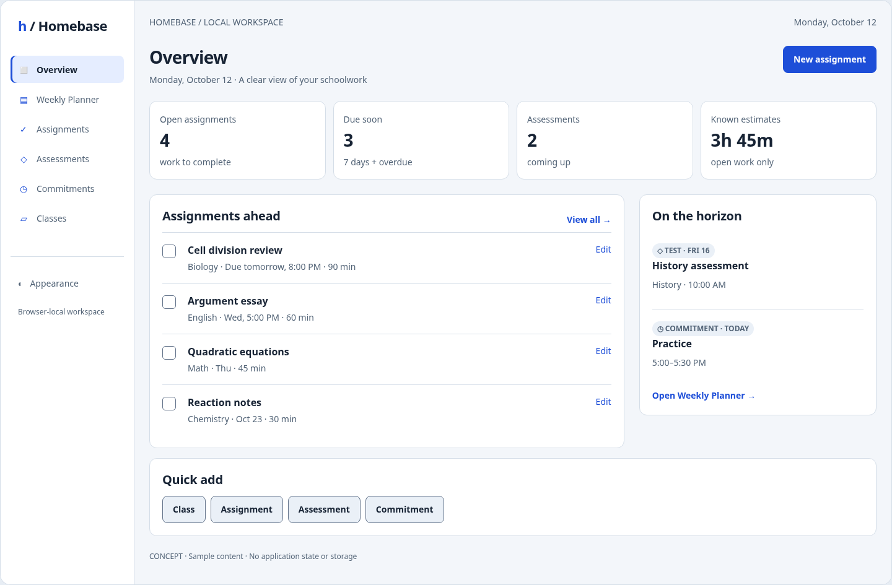
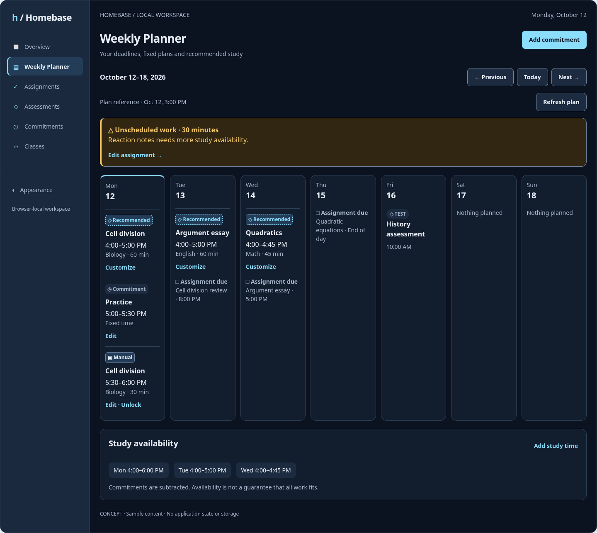
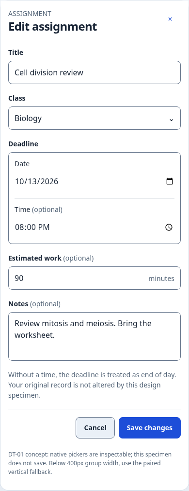
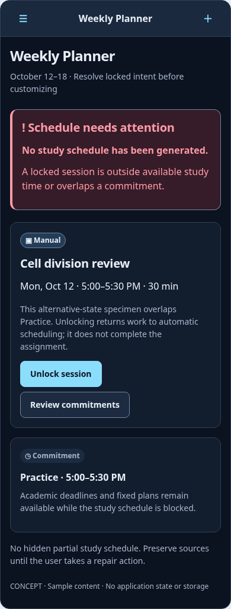
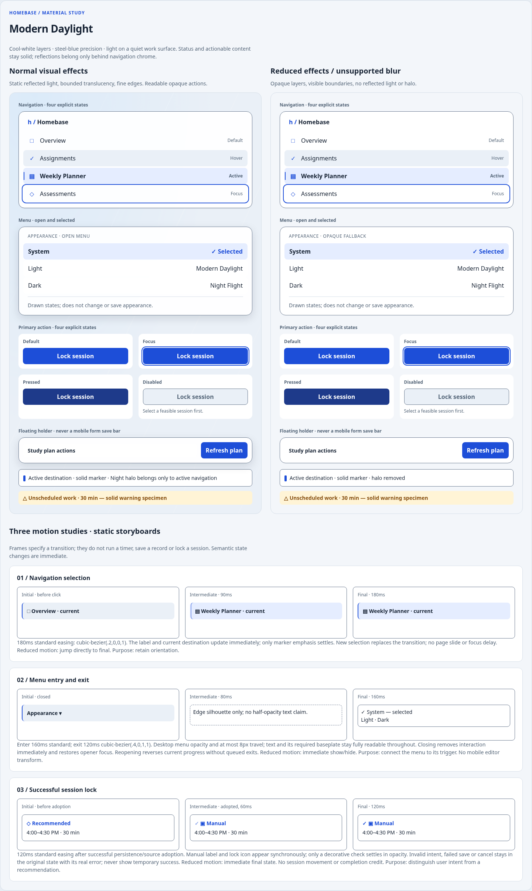
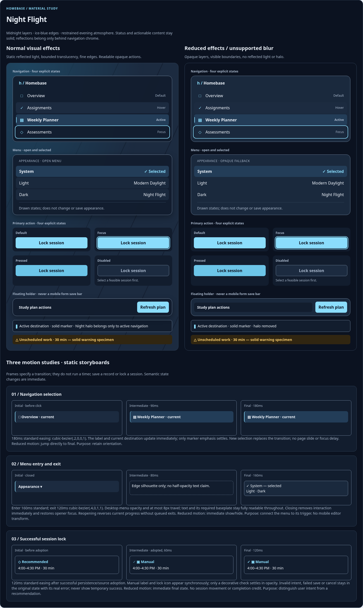

# Homebase 2.6A — design vision and research

Status: **final V6 design specification for independent review, not an implemented redesign**. Artistic exploration is complete; implementation may revisit it only for demonstrated accessibility or functional regressions. Original research checked 2026-10-08; consolidation checked 2026-10-10 UTC. Start with this document, then [system](02-design-system.md), [screens](03-screen-specifications.md), [motion](04-motion-and-interaction.md), [handoff](05-technical-handoff.md) and [acceptance](06-acceptance-and-milestones.md). The [final V6 visual reference](07-v6-visual-reference.md) and [supplemental gallery](assets/v6-reference.html) show the approved system. The [original atlas](assets/mockups.html) is a **superseded two-theme material/layout study**, retained for screen anatomy and storyboards only. Its controls are conceptual except native picker specimens; nothing saves or calls Homebase.

## Baseline and authority

Repository: `lilant5431/homebase`. Current integrated application baseline: remote main **`580b25f69a724a5e0c54e15927e05eafcda6d887`**, the merge of [PR #13](https://github.com/lilant5431/homebase/pull/13). PR #13 is MERGED; its reviewed documentation closure head was `4eab3f5863d396bbf2c73f25f7e301a4255eda36`. The existing `docs/phase-2-6a-design-spec` branch incorporates this main through a normal merge, preserving published history. Its diff against main remains design documentation/artifacts only; no production implementation or schema changes belong to 2.6A.

Historical research snapshot: the design branch originally started from main `b710ea0040f05ae873c853045124c3c82ad039d7`, when PR #13 was open at implementation head `352a744f356eb7ff84d428230438a9a772463e18`. Those references explain the original inventory and evidence; they are not the current baseline. The shared mobile document-scrolling editor, navigation stabilization and integrated acceptance infrastructure now exist in main and must be preserved.

The [integrated Phase 2 acceptance record](../../acceptance/phase-2.md) retains the actual physical results: eight targeted iPhone Safari keyboard/modal checks passed on `92991297ab8a84e5d34590c274c78fdc605ab12e`; four Date/Time visual checks failed on `352a744` (portrait Create/Edit clipping and alignment; landscape Create/Edit alignment), while native pickers remained usable. The baseline was merged with this documented visual exception. **DT-01: Unresolved — deferred to Phase 2.6E.** It does not invalidate the accepted keyboard-scrolling improvements. **DT-01 is scheduled for implementation and physical verification in 2.6E — Editors and grouped Date/Time.** Keep the preferred horizontal unified native group when measured width permits and the single-container paired vertical fallback otherwise. Neither the failed alignment correction nor the proposed redesign is declared physically accepted.

## Product identity

Homebase should feel like a precise personal work surface. Lead with a deadline, an actionable problem, or a next step. Typography, alignment and grouping supply structure; materials reinforce orientation. Retain the current six destinations, existing academic records and all scheduling semantics. Appearance is the one explicitly requested new preference surface. The full Capture → Understand → Prioritize → Schedule → Complete → Reflect → Adapt vision informs hierarchy, but does not authorize analytics, learning history or AI features that do not exist.

## Approved V6 identity

**Atmospheric, responsive, illuminated and fluid, with a functional academic interface that remains clear and readable.** [PR #15 at V6](https://github.com/lilant5431/homebase/pull/15), commit `0593c853596f47a5fbc4370b92f4e455bdef1a66`, is the pinned read-only visual/implementation reference. Its standalone Vite project is not a production integration template; do not merge/copy it into the app.

Two independent dimensions produce six appearances:

| Environment | Light palette               | Dark palette               |
| ----------- | --------------------------- | -------------------------- |
| `lattice`   | Sunlit Lattice              | Moonlit Lattice            |
| `landscape` | Atmospheric Landscape Light | Atmospheric Landscape Dark |
| `basic`     | Basic Light                 | Basic Dark                 |

Palette preference is `system | light | dark`; System follows live OS appearance, never the clock. Defaults: Lattice, System, Solid, System effects, System motion. One component structure and two semantic palettes serve every environment. Written class/source/status labels retain meaning across all six; decorative tokens do not change academic priorities or deadlines.

Sunlit Lattice preserves the architectural grid, diagonal sunlight, ambient workspace reflections and coordinated cool glass. Moonlit preserves that geometry/motion language with midnight/slate, steel lines, silver and restrained cyan illumination and distinctly dark branding/navigation. Its lighting is moonlight, not daytime sunlight. The approved short **112px × 8px illuminated capsule** occupies the original 26px slot above relevant planner content; it is decorative, pointer-transparent, hidden from assistive technology, with no focus/handler/new loop/cue target. Do not restore the rejected full-width bar.

Landscape is a continuous full-workspace natural scene: colored lightly filled mountain contours, concept-art linework, layered clouds, drawn lake reflections, sun/moon and sparse steady Dark stars. Light/Dark share geometry and gentle coordinated lighting. No scenic banner, runway/cockpit/airplane imagery or fictional flight data. The V3 band and former Night Flight aviation identity are **historical, superseded**. Basic deliberately omits continuous atmosphere while retaining polished typography, geometry, navigation and functional indicators; it is a complete low-decoration choice.

Solid is the opaque content default. Frosted is the only alternative: bounded translucent panels, fully opaque text and readability protections. Editors, error explanations and critical labels remain solid. Navigation/interaction glass is a separate material. Appearance never changes a plan, completion state, reference time or record.

## Research synthesis

Authoritative means a standard, platform guideline or documented API; vendor product design is inspiration, not an accessibility rule. The decisions below are Homebase adaptations, not copies of vendor screens.

| Source                                                                                                                                                                             | Evidence type and observation                                                                                               | Homebase decision                                                                                                                                                                                                                                                      |
| ---------------------------------------------------------------------------------------------------------------------------------------------------------------------------------- | --------------------------------------------------------------------------------------------------------------------------- | ---------------------------------------------------------------------------------------------------------------------------------------------------------------------------------------------------------------------------------------------------------------------- |
| [Apple HIG Materials](https://developer.apple.com/design/human-interface-guidelines/materials), [Meet Liquid Glass, WWDC25](https://developer.apple.com/videos/play/wwdc2025/219/) | Native-platform guidance: material separates navigation/control layers from content and responds to accessibility settings. | Use bounded chrome translucency and opt-in Frosted noncritical content; forms, semantic session surfaces and errors remain solid. CSS blur is an approximation; SwiftUI Liquid Glass APIs are not web APIs.                                                            |
| [Linear, March 2026 design refresh](https://linear.app/now/behind-the-latest-design-refresh), [release notes](https://linear.app/changelog/2026-03-12-ui-refresh)                  | First-party design rationale: consistent headers and navigation reduce friction while content stays prominent.              | A stable page header/action location, quieter navigation and compact metadata. Do not import Linear's issue taxonomy or icon-only density.                                                                                                                             |
| [Raycast, A fresh look and feel](https://www.raycast.com/blog/a-fresh-look-and-feel), [extension design rationale](https://www.raycast.com/blog/how-raycast-api-extensions-work)   | First-party inspiration: prominent purpose, contextual action area and consistent interaction primitives.                   | Clear form title + one primary save action; secondary controls retain labels. A command palette is deliberately excluded: Homebase has no command/search model.                                                                                                        |
| [Flighty](https://flighty.com/)                                                                                                                                                    | Public product presentation: time, changing status and consequential information are emphasized in a travel context.        | Tabular times, explicit Manual/Recommended labels and prominent conflict reasons. Historical information-hierarchy inspiration only; V6 replaces aviation atmosphere with natural landscapes. No copied boarding pass or aviation UI.                                  |
| [Motion accessibility](https://motion.dev/docs/react-accessibility)                                                                                                                | Library guidance: reduced-motion controls can remove transform/layout animation while retaining state feedback.             | CSS is sufficient for this scope. Adopt equivalent reduced-motion behavior without installing Motion. Reconsider only for a proven multi-element orchestration need.                                                                                                   |
| [Rive web runtime](https://rive.app/docs/runtimes/web/web-js)                                                                                                                      | Runtime documentation: canvas animation/state-machine assets and lifecycle management.                                      | No Rive dependency: there is no required animated illustration. A canvas must never replace semantic status, focus or forms.                                                                                                                                           |
| [WCAG 2.2](https://www.w3.org/TR/WCAG22/)                                                                                                                                          | Normative accessibility standard.                                                                                           | Normal text ≥4.5:1; essential component/state boundaries ≥3:1; reflow, visible/unobscured focus, labels, error identification and alternatives to color. Use 44px targets as Homebase's standard; WCAG AA 2.5.8 minimum is 24px with exceptions, not universally 44px. |
| [Browser keyboard viewport model](https://developer.chrome.com/blog/viewport-resize-behavior/), [WebKit fixed-focus report](https://bugs.webkit.org/show_bug.cgi?id=207049)        | Browser explanation and issue evidence; not a diagnosis of every Safari version.                                            | Preserve the physically successful document-scrolling mobile editor. Do not reintroduce fixed-body forms, nested keyboard scrollers or speculative VisualViewport corrections.                                                                                         |

## Design principles and choices

1. Orientation precedes decoration: destination title, date/week context, one primary action, then content.
2. Show why attention is needed using known facts: overdue/due date, unplaced minutes or a specific conflict. Do not present opaque priority scores or imply grade importance.
3. Keep recommendations visibly distinct from decisions: Recommended with a recommendation icon/dashed marker; Manual with a lock/solid marker; Commitment with calendar label; Due with deadline label.
4. Treat a failed save as information the user must retain. Persistent inline/global warning beats a disappearing toast; no success celebration before confirmed persistence.
5. Use progressive effects: the opaque, motionless version is the complete interface. Blur and transitions add polish only after functional acceptance.
6. Design for short height, zoom and touch from the start. A one-column phone agenda is a first-class layout, not a shrunken desktop week.

Rejected: unprotected glass under academic text (variable contrast); animated skyline (distraction/cost); custom date/time picker (new interaction burden without evidence); fixed bottom mobile save bar (keyboard obstruction); new global search/detail routes (unsupported product scope); priority reorder on Overview (changes established ordering); preserving two Date/Time columns at all costs (known physical failure).

## Decision ownership

The artistic direction, mobile layouts and component hierarchy are fixed by the approved V6 reference. Remaining decisions concern measured contrast, compositing cost and native picker fit, not new visual concepts. DT-01 still needs physical iPhone evidence in 2.6E; retain the single-container paired vertical fallback unless the preferred horizontal Date | Time group demonstrably fits. Follow the [milestone gates](06-acceptance-and-milestones.md).

## Historical atlas snapshots — superseded visual identity

These are historical browser-rendered conceptual boards from the original static atlas, not the final V6 visual target or screenshots of implemented Homebase. The atlas contains all 28 compositions; these four snapshots make the main visual direction reviewable directly in GitHub. The editor shows the safe narrow-width alternative, not a claimed physical Safari fix.

## Historical materials and motion supplement

The historical [Materials & Motion Showcase](assets/mockups.html#materials-motion) records earlier chrome/state studies; the [V6 reference](07-v6-visual-reference.md) supersedes its atmosphere and material recipes. Both themes show normal effects beside the opaque alternative: navigation default/hover/active/focus, selected open menus, primary action default/focus/press/disabled, and floating chrome with opaque actionable content. Three static storyboards define selection, menu entry/exit and **successful** lock feedback. Native buttons allow inspecting CSS hover/focus/press but have no product handlers, network calls or storage access.

Daylight uses a cool-white scrim, reflected daylight behind chrome, fine white edge highlights and restrained blue markers. Night uses a midnight scrim, static blue light behind chrome, ice-blue marker and one small active-marker halo. Amber remains consequential warning, not decorative illumination. No glass is applied to academic text, editor fields or conflict explanations. The reflected backdrop is a material-test scene, not proposed wallpaper underneath product content.

These supplement the existing token system: no semantic foreground, action, status, focus or glass alpha was changed. Exact material recipes and reductions are recorded in 02; the storyboards and interruption behavior are in 04. The approved V6 direction now governs depth/reflection; final production contrast/performance still requires implementation-device testing.

