# Final V6 visual reference

Authoritative visual source: [PR #15](https://github.com/lilant5431/homebase/pull/15), **`0593c853596f47a5fbc4370b92f4e455bdef1a66`**. [Open the local supplemental gallery](assets/v6-reference.html). The independent React/Vite audition is read-only and is not copied or merged into PR #14. The approved artistic direction is fixed.

## Provenance and permitted use

Eleven selected screenshots are byte-identical copies of committed V6 assets, not regenerated or edited mockups. [Source manifest](assets/v6/source-manifest.json) records original paths and SHA-256 digests; [bundled notices](assets/v6/third-party-notices.txt) preserve Magic UI MIT, Lucide ISC and bundled font notices. Landscape/capsule/artistic composition is Homebase original work; Grid Pattern/Magic Card adaptations in the rendered reference retain their existing attribution. No React Bits, paid effect, external image or runtime library is copied. Original [source audit](https://github.com/lilant5431/homebase/blob/0593c853596f47a5fbc4370b92f4e455bdef1a66/experiments/phase-2-6a-v-visual-audition/research/component-audit.md) and [MIT provenance](https://github.com/lilant5431/homebase/blob/0593c853596f47a5fbc4370b92f4e455bdef1a66/experiments/phase-2-6a-v-visual-audition/vendor/source-manifest.json) remain pinned source references.

## What these images establish

They show six appearances using shared layouts, final dark branding, full-workspace Landscape, deliberate Basic, the Solid/Frosted material contrast and short illuminated capsule. The fixed illustrative record text is not a new product feature. No screenshot proves animation fluidity, native Date/Time correctness, physical Safari performance, keyboard behavior or battery/thermal cost. The old [atlas](assets/mockups.html) and previews remain **historical two-theme layout/material studies**; its Night Flight aviation identity is superseded, not a current environment.

The gallery’s Play light cue button, presets, intensity/speed tuning and source-comparison controls are experimental instrumentation. Production uses the [actual-button activation/result contract](04-motion-and-interaction.md), with no demo control or new graphics-quality setting.

## Prior V6 verification (not rerun here)

[Pinned verification record](https://github.com/lilant5431/homebase/blob/0593c853596f47a5fbc4370b92f4e455bdef1a66/experiments/phase-2-6a-v-visual-audition/research/verification.md): 47 experiment tests; Chromium and Linux WebKit passed 582 geometry, 164 capsule and 288 cue cases. [Material record](https://github.com/lilant5431/homebase/blob/0593c853596f47a5fbc4370b92f4e455bdef1a66/experiments/phase-2-6a-v-visual-audition/research/material-v6-results.md): 704 computed roles, sampled minimum 6.07:1 and Frosted envelope minimum 4.84:1. These are earlier experiment results, not current documentation checks or new physical iPhone outcomes. Documentation recomputes 92 semantic, four reflection and eight Frosted-envelope pairs only; production assembled-interface tests follow in B–G.

## Selected references

### Sunlit Lattice

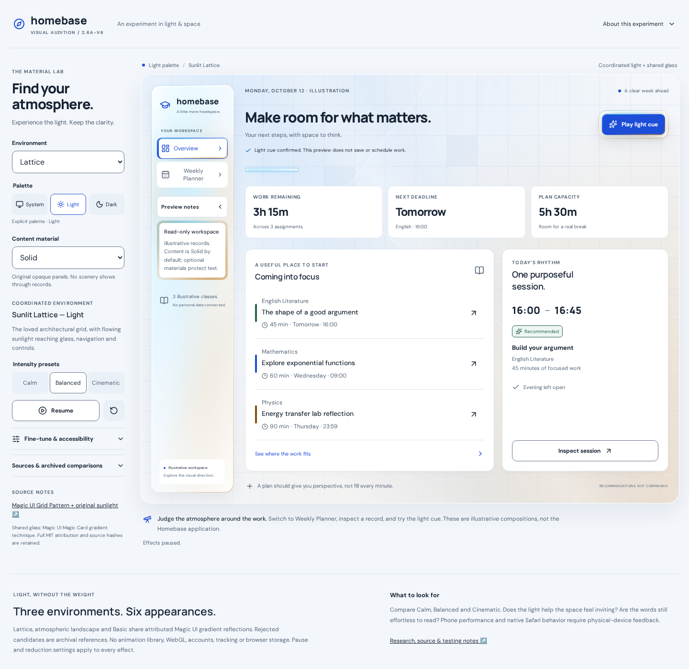

[Exact upstream asset](https://github.com/lilant5431/homebase/blob/0593c853596f47a5fbc4370b92f4e455bdef1a66/experiments/phase-2-6a-v-visual-audition/screenshots/v6-lattice-light-overview-desktop-solid.png)

### Moonlit Lattice

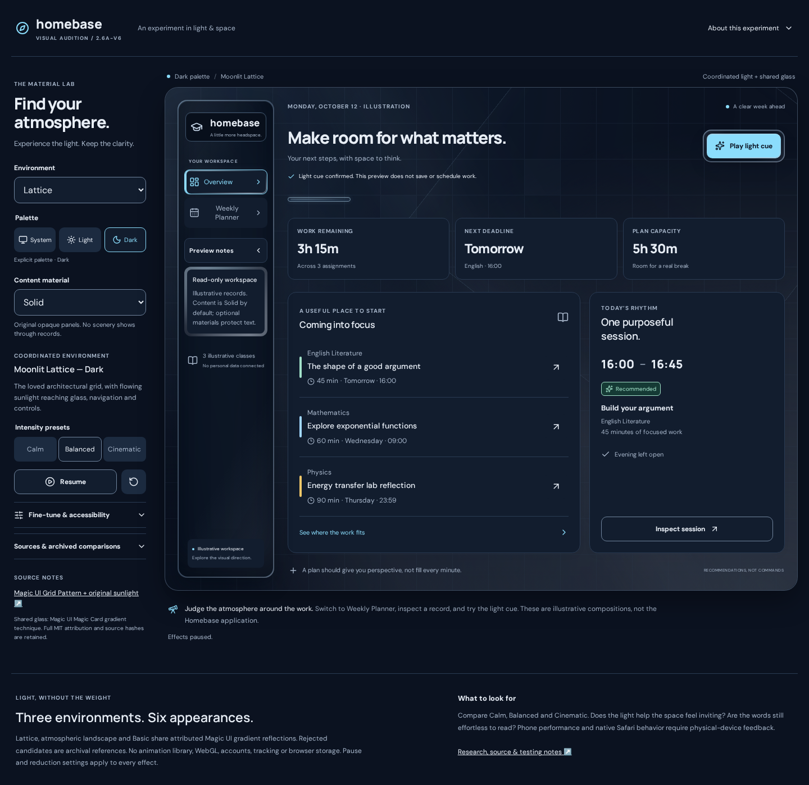

[Exact upstream asset](https://github.com/lilant5431/homebase/blob/0593c853596f47a5fbc4370b92f4e455bdef1a66/experiments/phase-2-6a-v-visual-audition/screenshots/v6-lattice-dark-overview-desktop-solid.png)

### Atmospheric Landscape Light

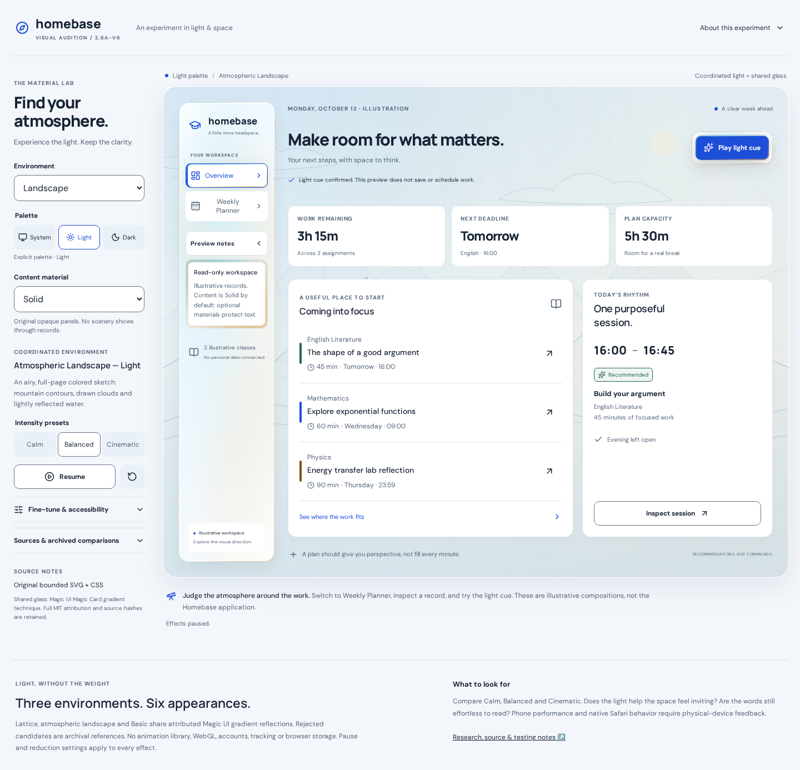

[Exact upstream asset](https://github.com/lilant5431/homebase/blob/0593c853596f47a5fbc4370b92f4e455bdef1a66/experiments/phase-2-6a-v-visual-audition/screenshots/v6-landscape-light-overview-desktop-solid.png)

### Atmospheric Landscape Dark

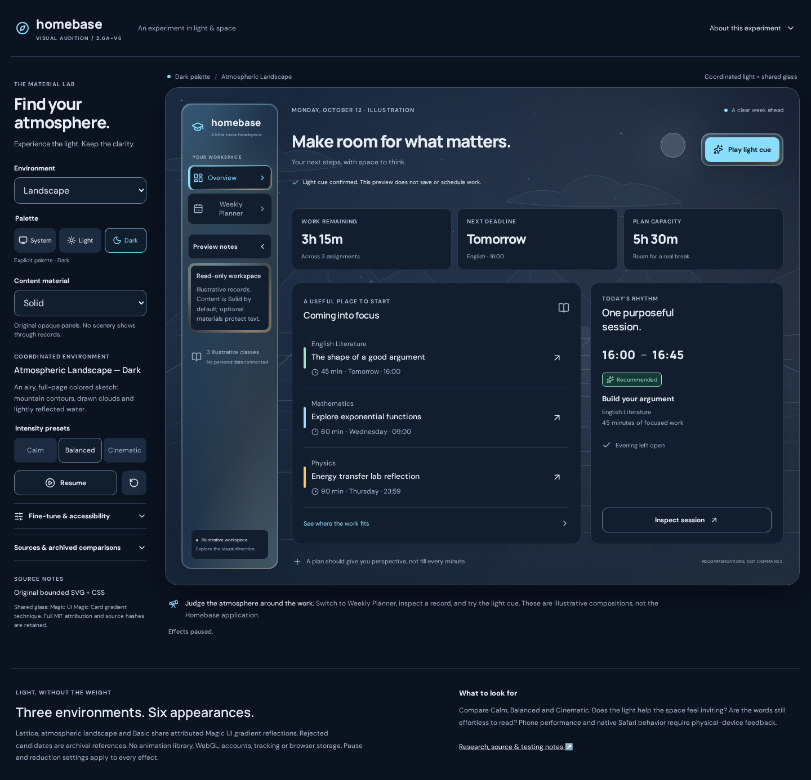

[Exact upstream asset](https://github.com/lilant5431/homebase/blob/0593c853596f47a5fbc4370b92f4e455bdef1a66/experiments/phase-2-6a-v-visual-audition/screenshots/v6-landscape-dark-overview-desktop-solid.png)

### Basic Light

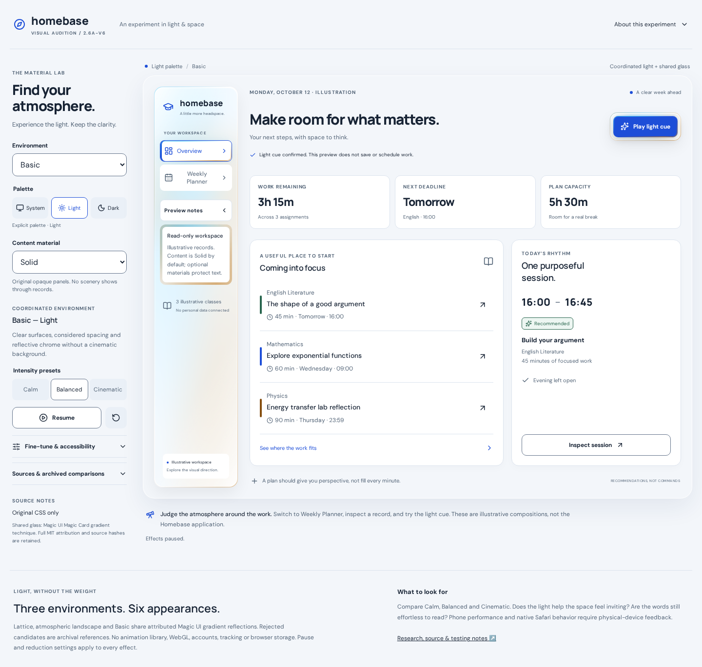

[Exact upstream asset](https://github.com/lilant5431/homebase/blob/0593c853596f47a5fbc4370b92f4e455bdef1a66/experiments/phase-2-6a-v-visual-audition/screenshots/v6-basic-light-overview-desktop-solid.png)

### Basic Dark

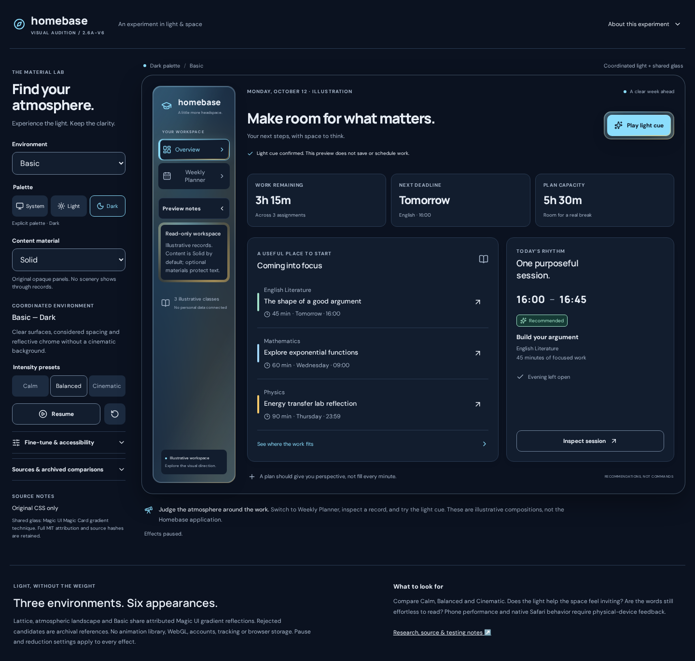

[Exact upstream asset](https://github.com/lilant5431/homebase/blob/0593c853596f47a5fbc4370b92f4e455bdef1a66/experiments/phase-2-6a-v-visual-audition/screenshots/v6-basic-dark-overview-desktop-solid.png)

### Landscape Dark — Frosted (compare with Solid above)

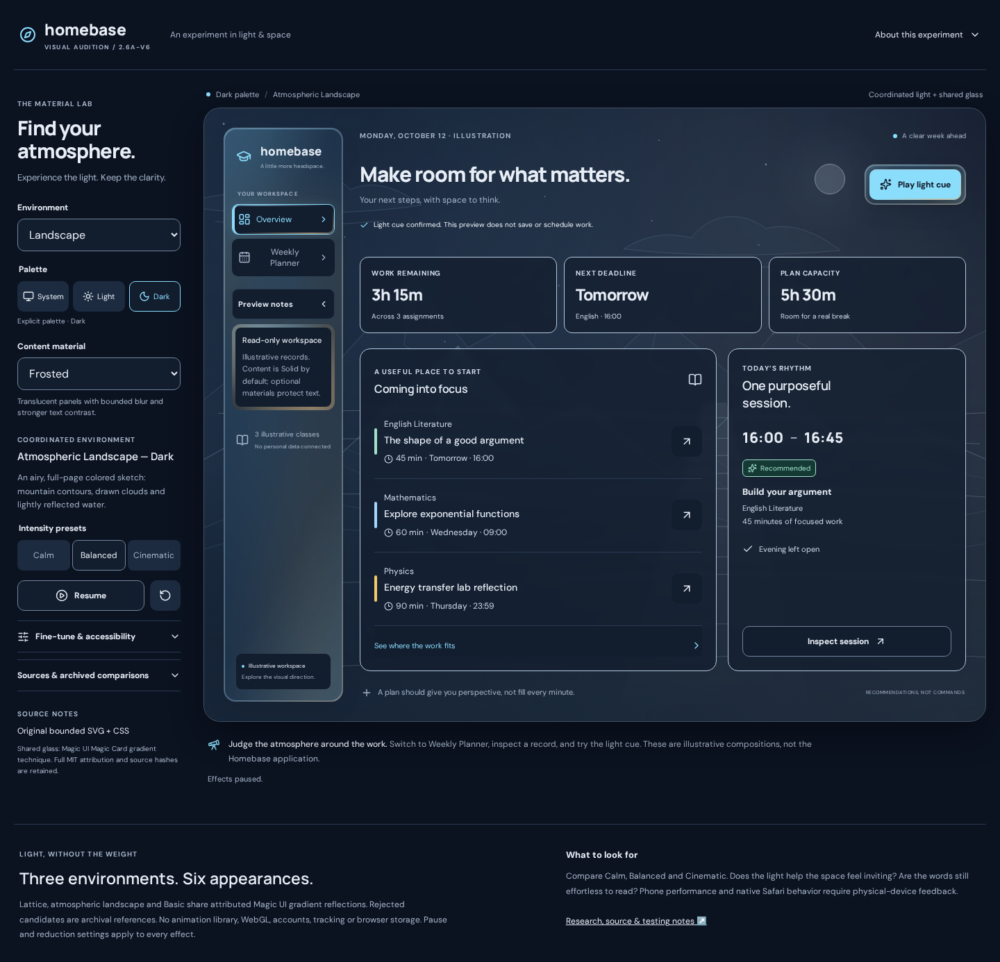

[Exact upstream asset](https://github.com/lilant5431/homebase/blob/0593c853596f47a5fbc4370b92f4e455bdef1a66/experiments/phase-2-6a-v-visual-audition/screenshots/v6-landscape-dark-overview-desktop-frosted.png)

### Common phone layout — Moonlit / Solid

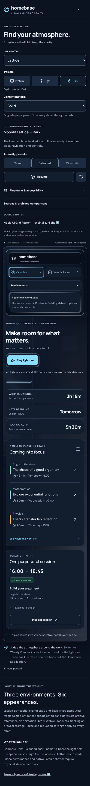

[Exact upstream asset](https://github.com/lilant5431/homebase/blob/0593c853596f47a5fbc4370b92f4e455bdef1a66/experiments/phase-2-6a-v-visual-audition/screenshots/v6-lattice-dark-overview-phone-solid.png)

### Long phone planner — Landscape Light / Frosted

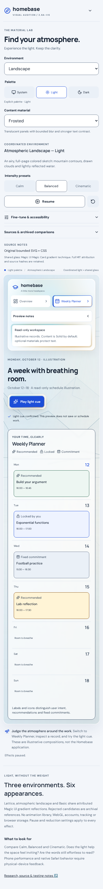

[Exact upstream asset](https://github.com/lilant5431/homebase/blob/0593c853596f47a5fbc4370b92f4e455bdef1a66/experiments/phase-2-6a-v-visual-audition/screenshots/v6-landscape-light-planner-phone-frosted.png)

### Sunlit decorative capsule / Planner

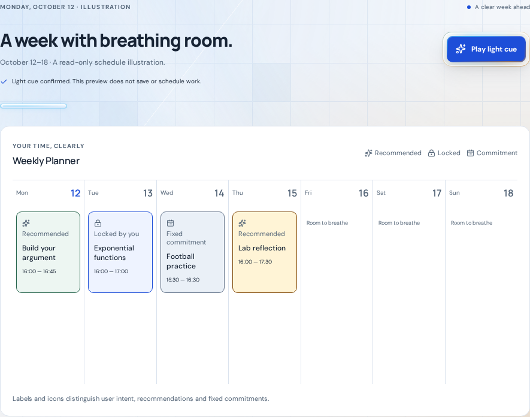

[Exact upstream asset](https://github.com/lilant5431/homebase/blob/0593c853596f47a5fbc4370b92f4e455bdef1a66/experiments/phase-2-6a-v-visual-audition/screenshots/v6-lattice-light-accent-1440.png)

### Moonlit decorative capsule / Planner

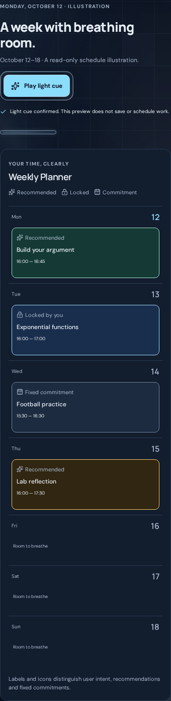

[Exact upstream asset](https://github.com/lilant5431/homebase/blob/0593c853596f47a5fbc4370b92f4e455bdef1a66/experiments/phase-2-6a-v-visual-audition/screenshots/v6-lattice-dark-accent-390.png)
